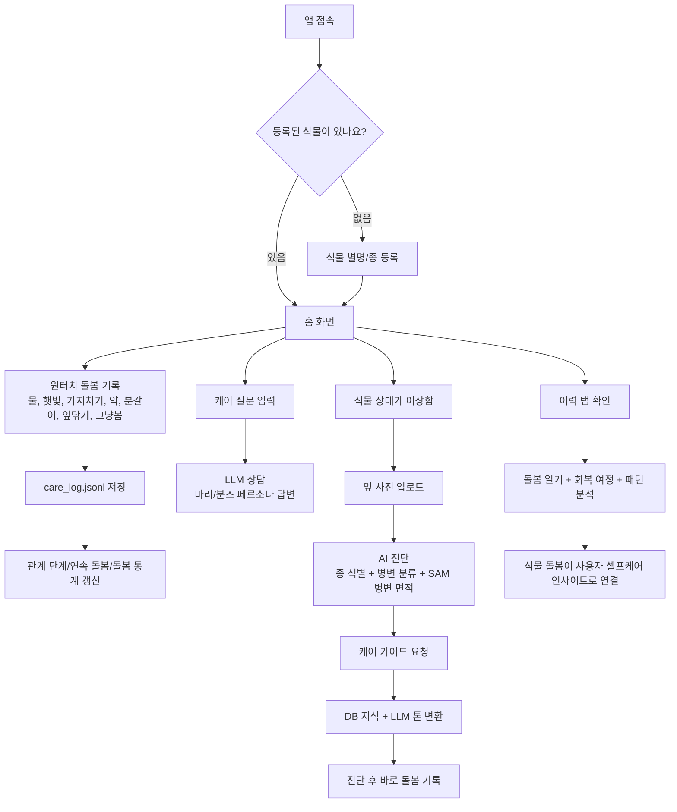
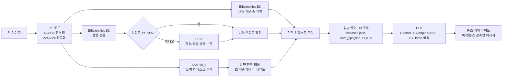
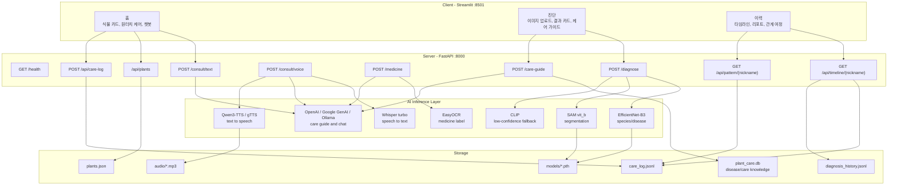

# Boonz - PlantCare AI

> 식물의 상태를 진단하고, 돌봄 기록을 쌓아 사용자의 셀프케어 루틴까지 이어주는 AI 반려식물 케어 서비스

GitHub: https://github.com/Potenup3DeepLearning3/PlantCareAI

## 프로젝트 소개

| 항목 | 내용 |
| --- | --- |
| 한 줄 요약 | 반려식물 사진 진단, 케어 가이드, 돌봄 기록을 통해 "식물을 돌보는 시간"을 "나를 돌보는 시간"으로 확장하는 AI 서비스 |
| 팀 | 유현희, 이정미, 임태나 |
| 기간 | 2026.03.31 - 2026.04.09 저장소 구현 및 문서 기준 |
| 서비스명 | Boonz |
| 설명 | 사용자가 식물을 등록하고 매일 원터치로 돌봄을 기록하면, Boonz가 관계 성장 단계와 돌봄 패턴을 보여준다. 식물이 아플 때는 잎 사진을 업로드해 종, 병변, 병변 면적을 분석하고, LLM 기반 케어 가이드를 제공한다. |

## 기술 스택

| 영역 | 기술 |
| --- | --- |
| Frontend | Streamlit |
| Backend | FastAPI, Uvicorn, Pydantic |
| Vision AI | PyTorch, Torchvision, EfficientNet-B3, ConvNeXt-Tiny 비교 실험, SAM vit_b, CLIP |
| Text/Voice AI | OpenAI API, Google GenAI/Gemma, Ollama, Whisper turbo, Qwen3-TTS, gTTS |
| OCR | EasyOCR |
| Data | JSON, JSONL, SQLite, PlantVillage, House Plant Species, PlantDoc, NCPMS 지식 데이터 |
| Dev Tools | uv, pytest, python-dotenv, loguru |

## 핵심 기능

| 기능 | 설명 | AI/알고리즘 |
| --- | --- | --- |
| 식물 등록 | 식물 별명과 종을 등록하고 관계를 시작 | `plants.json` 저장 |
| 원터치 돌봄 기록 | 물 주기, 자리 이동, 가지치기, 약, 분갈이, 잎 닦기, 그냥 보기 기록 | `care_log.jsonl` 누적 |
| 식물 사진 진단 | 잎 사진으로 식물 종과 병변을 분류 | EfficientNet-B3 |
| 병변 영역 표시 | 잎/병변 영역을 세그멘테이션하고 병변 비율 산출 | SAM vit_b |
| 저신뢰도 보완 | 병변 분류 신뢰도가 낮을 때 환경/해충 상태 보완 분석 | CLIP |
| 케어 가이드 | 진단 결과와 DB 지식을 바탕으로 관계형 문체의 관리 가이드 생성 | OpenAI/Google GenAI/Ollama |
| 텍스트 상담 | 식물 돌봄 질문에 진단 맥락을 반영해 답변 | LLM |
| 음성 상담 | 음성 질문을 텍스트로 변환한 뒤 답변과 음성 파일 생성 | Whisper, TTS |
| 약제 체크 | 약제 라벨 이미지 OCR 후 현재 진단과 적합성 판단 | EasyOCR, LLM |
| 돌봄 패턴 분석 | 누적 로그로 연속성, 다양성, 반응성을 분석 | 규칙 기반 + LLM |

## 사용자 서비스 플로우



## AI 핵심 기능 흐름



## 서버 통신 아키텍처



## API 요약

| Method | Endpoint | 설명 |
| --- | --- | --- |
| GET | `/health` | 서버 상태 확인 |
| POST | `/diagnose` | 잎 이미지 업로드 후 종, 병변, 병변 면적, SAM 오버레이 반환 |
| POST | `/care-guide` | 진단 결과를 바탕으로 DB 기반 케어 가이드 생성 |
| POST | `/consult/text` | 텍스트 돌봄 상담 |
| POST | `/consult/voice` | 음성 상담: STT -> LLM -> TTS |
| POST | `/medicine` | 약제 라벨 OCR 및 적합성 판단 |
| GET/POST | `/api/plants` | 식물 목록 조회 및 등록 |
| POST | `/api/care-log` | 원터치 돌봄 기록 저장 |
| GET | `/api/timeline/{nickname}` | 진단/돌봄 통합 타임라인 조회 |
| GET | `/api/pattern/{nickname}` | 돌봄 패턴 분석 |

## 프로젝트 구조

```text
PlantCareAI/
├── README.md
├── pyproject.toml
├── train_efficientnet_B3.py
├── models/
│   ├── disease/
│   ├── species/
│   └── sam/
└── 임태나/
    ├── src/
    │   ├── api/
    │   │   ├── main.py
    │   │   └── routes/
    │   ├── data/
    │   ├── frontend/
    │   │   └── app.py
    │   ├── inference/
    │   │   ├── diagnose.py
    │   │   ├── llm.py
    │   │   ├── ocr.py
    │   │   ├── stt.py
    │   │   └── tts.py
    │   └── models/
    ├── data/
    │   ├── plants.json
    │   ├── care_log.jsonl
    │   ├── diseases.json
    │   ├── care_tips.json
    │   └── plant_care.db
    ├── docs/
    ├── scripts/
    └── tests/
```

## 설치 및 실행 방법

### 1. 저장소 클론

```bash
git clone https://github.com/Potenup3DeepLearning3/PlantCareAI.git
cd PlantCareAI
```

### 2. Python 및 uv 준비

```bash
python --version
uv --version
```

권장 환경은 Python 3.12 이상입니다.

### 3. 의존성 설치

루트 환경을 사용할 경우:

```bash
uv venv
.venv\Scripts\activate
uv sync
```

서비스 구현 폴더 기준으로 실행할 경우:

```bash
cd 임태나
uv venv
.venv\Scripts\activate
uv sync --extra inference
```

### 4. 환경변수 설정

`임태나/.env` 파일을 생성하고 필요한 API 키를 입력합니다.

```env
OPENAI_API_KEY=your_openai_api_key
OPENAI_MODEL=gpt-4o-mini
GOOGLE_API_KEY=your_google_api_key
GEMMA4_MODEL=gemma-3-4b-it
OLLAMA_BASE_URL=http://localhost:11434
OLLAMA_MODEL=gemma3:4b
```

OpenAI 또는 Google API 키가 없으면 로컬 Ollama 폴백을 사용할 수 있습니다.

### 5. 데이터베이스 초기화

```bash
cd 임태나
python scripts/init_db.py
python scripts/generate_demo_data.py
```

### 6. 백엔드 실행

```bash
cd 임태나
uvicorn src.api.main:app --reload --port 8000
```

서버 확인:

```bash
curl http://localhost:8000/health
```

### 7. 프론트엔드 실행

새 터미널에서 실행합니다.

```bash
cd 임태나
streamlit run src/frontend/app.py --server.port 8501
```

브라우저에서 접속:

```text
http://localhost:8501
```

### 8. 선택: 로컬 LLM 실행

Ollama 폴백을 사용할 경우 별도 터미널에서 실행합니다.

```bash
ollama serve
ollama pull gemma3:4b
```

## 테스트

```bash
cd 임태나
pytest tests/ -v
```

모델 파일이 필요한 통합 테스트는 `models/` 경로에 학습된 `.pth` 파일과 SAM 체크포인트가 준비되어 있어야 합니다.

## 모델 성능 요약

| 모델 | 평가 데이터 | 성능 |
| --- | --- | --- |
| EfficientNet-B3 병변 분류 | PlantVillage test | Accuracy 99.89%, weighted F1 0.9993 |
| EfficientNet-B3 종 식별 | House Plant Species test | Accuracy 90.46%, weighted F1 0.9040 |
| PlantDoc 크로스 테스트 | 실제 환경 이미지 | Accuracy 59.24%, weighted F1 0.5571 |

PlantVillage는 통제된 이미지 환경이므로 실제 사용자 사진에서는 배경, 조명, 각도 차이로 정확도가 낮아질 수 있습니다. 이를 보완하기 위해 SAM 병변 면적, CLIP 저신뢰도 폴백, LLM의 불확실성 표현을 함께 사용합니다.

## 발표 자료용 시각화 안내

README의 Mermaid 다이어그램은 GitHub에서 바로 렌더링됩니다. 발표용 이미지가 필요하면 Mermaid Live Editor, draw.io, Canva, Napkin AI, Nano Banana 계열 이미지 생성 도구 등에 복사해 서비스 플로우 차트와 서버 아키텍처 이미지로 변환하면 됩니다.
