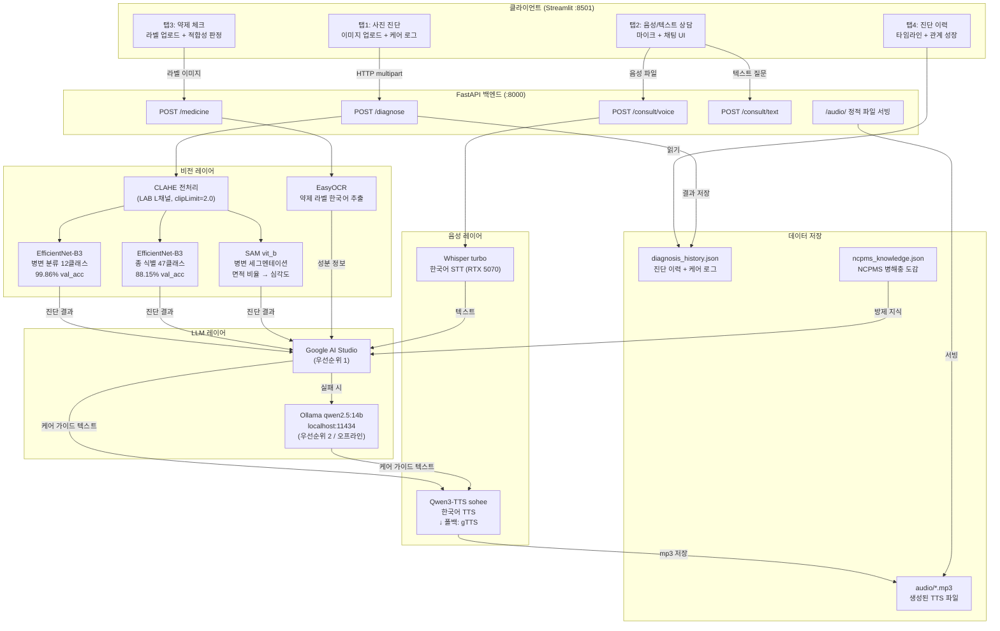
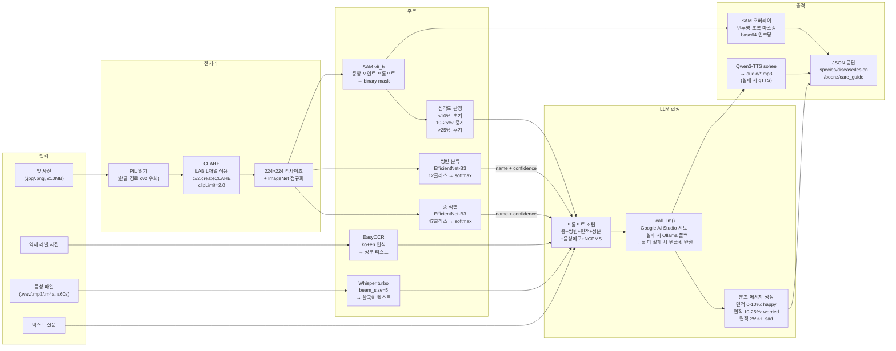
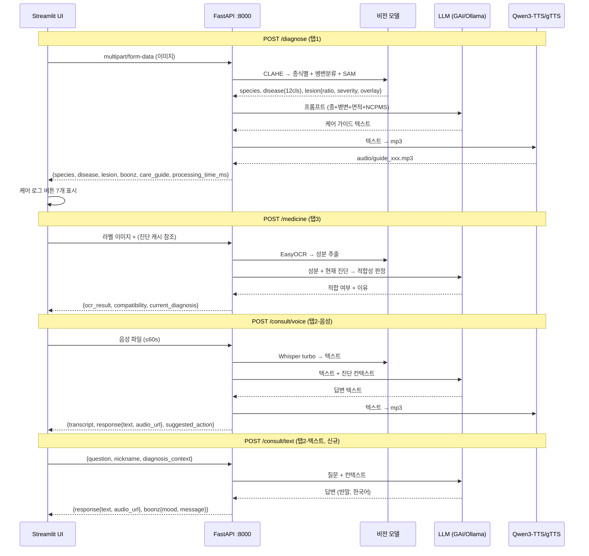
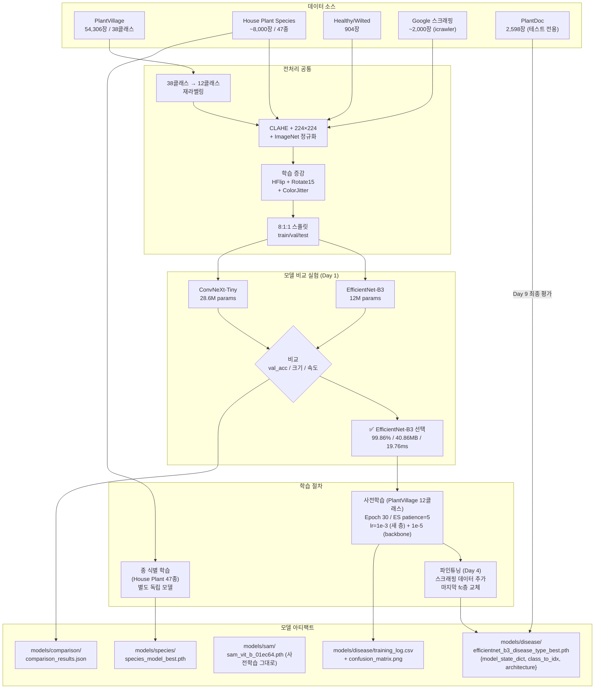
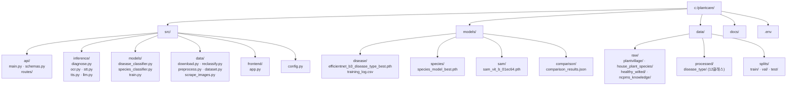

# PlantCare AI 아키텍처 (v3 — 최신)

> 마지막 업데이트: 2026-04-06
> 실제 구현 기준 (병변 12클래스, Whisper turbo, Qwen3-TTS, LLM 이중화, /consult/text 신규)

---

## 1. 전체 시스템 아키텍처

---

## 2. 추론 파이프라인 (런타임 상세)

---

## 3. API 흐름도

---

## 4. 모델 학습 파이프라인

---

## 5. 폴더 구조

---

## 병변 12클래스 매핑

| 클래스명 | 한국어 |
|---------|--------|
| Bacterial_Spot | 세균성 반점 |
| Early_Blight | 초기 마름병 |
| Greening | 그리닝병 |
| Healthy | 건강 |
| Late_Blight | 후기 마름병 |
| Leaf_Curl | 잎 말림 |
| Leaf_Mold | 잎 곰팡이 |
| Leaf_Spot | 잎 반점 |
| Mosaic_Virus | 모자이크 바이러스 |
| Powdery_Mildew | 흰가루병 |
| Rust | 녹병 |
| Scab_Rot | 딱지병/부패 |
