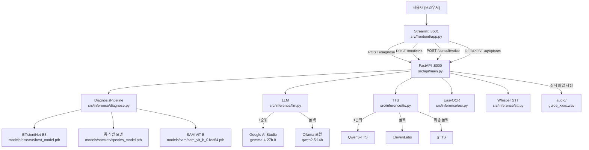

# PlantCare (Boonz) 리버스 엔지니어링 가이드

---

# 모드 1: 학습용 커리큘럼

> **역할**: 코딩 교육자. 이 프로젝트의 코드를 분석해서, 학습자가 처음부터 직접 만들어볼 수 있도록 단계별 학습 커리큘럼을 제공한다.

---

## Step 1: 기술 스택 분석

| 기술 | 왜 쓰는가 | 선수 지식 |
|------|----------|----------|
| Python 3.12 | 타입 힌트 강화(`X \| Y` 문법), 성능 개선 | 기본 Python |
| FastAPI | 비동기 REST API, 자동 Swagger 문서, Pydantic 통합 | HTTP 메서드, 함수 |
| Streamlit | Python만으로 UI 구성 — JS/CSS 없이 프로토타입 | 기본 Python |
| PyTorch + torchvision | GPU 가속 딥러닝, Transfer Learning API | numpy, 행렬 개념 |
| EfficientNet-B3 / ConvNeXt-Tiny | ImageNet 사전학습 → 도메인 파인튜닝 (소량 데이터로 고성능) | CNN 개념 |
| SAM (Segment Anything) | 포인트 프롬프트로 객체 마스크 생성 — 병변 면적 측정 | 마스크/픽셀 개념 |
| EasyOCR | 한국어 포함 다국어 텍스트 인식, GPU 가속 | 없음 |
| Whisper | 로컬 GPU에서 한국어 STT — API 비용 없음 | 없음 |
| Ollama / Google AI Studio | 로컬 LLM 또는 무료 API로 텍스트 생성 — Claude/GPT 비용 없음 | HTTP 요청 개념 |
| Qwen3-TTS / gTTS | 텍스트→음성 — gTTS는 폴백용 (품질 낮지만 키 불필요) | 없음 |
| loguru | `print()` 대체, 파일 로테이션, 레벨 관리 | 없음 |
| pathlib | `os.path` 대체, 경로를 객체로 다룸 | 없음 |
| pydantic | 데이터 검증 + FastAPI 스키마 자동 생성 | 없음 |

---

## Step 2: 학습 단계 설계

### Stage 1 — 환경과 설정 관리

**배울 개념**: `pathlib.Path`, `python-dotenv`, 중앙 설정 파일 패턴, loguru 로깅, 시드 고정

**도전 과제** *(코드를 보기 전에 직접 먼저 작성해보세요)*

> 다음 조건을 만족하는 `config.py`를 작성해보세요:
>
> - 프로젝트 루트, 데이터 디렉토리, 모델 디렉토리 경로를 `pathlib.Path`로 정의
> - Ollama URL, 모델명은 `.env`에서 읽고, 없으면 기본값 사용
> - 모든 필요한 디렉토리를 자동 생성하는 `ensure_dirs()` 함수
> - PyTorch/numpy 시드를 한 번에 고정하는 `set_seed()` 함수
> - GPU/CPU를 자동 감지하는 `get_device()` 함수
>
> 힌트: `Path(__file__).resolve().parent.parent` 패턴을 사용합니다.

**이 프로젝트의 해당 위치**: `src/config.py` 전체

**흔한 실수**
- `Path(__file__).parent` 와 `.resolve().parent` 의 차이 — 심볼릭 링크 환경에서 다름
- `os.getenv("KEY", "default")` vs `os.getenv("KEY") or "default"` — 빈 문자열 처리 다름
- `mkdir(parents=True, exist_ok=True)` 의 `exist_ok` 누락 → 두 번 실행 시 오류

---

### Stage 2 — 이미지 전처리 파이프라인

**배울 개념**: OpenCV, LAB 색공간, CLAHE, torchvision transforms, numpy↔tensor 변환

**도전 과제**

> 임의 이미지를 받아 분류 모델 입력 텐서로 만드는 `preprocess_for_classification(image_rgb)` 함수를 작성해보세요:
>
> 1. RGB numpy 배열 → BGR 변환 (OpenCV는 BGR 기준)
> 2. CLAHE 적용 (조명 정규화)
> 3. 224×224 리사이즈
> 4. BGR→RGB 재변환 → `torch.Tensor` (C, H, W)
> 5. `[0, 255]` → `[0.0, 1.0]` 정규화
> 6. ImageNet mean/std 정규화
> 7. 배치 차원 추가 → `(1, 3, 224, 224)`
>
> CLAHE는 직접 구현: LAB 색공간 L채널에만 적용합니다.
>
> 힌트: `cv2.COLOR_BGR2LAB`, `cv2.createCLAHE`, `torch.from_numpy().permute(2, 0, 1)` 패턴을 사용합니다.

**이 프로젝트의 해당 위치**
- `src/data/preprocess.py` → `apply_clahe()` (29번째 줄)
- `src/inference/diagnose.py` → `_preprocess_for_classification()` (488번째 줄)

**흔한 실수**
- CLAHE를 RGB 채널 전체에 적용 → 색상 깨짐. 반드시 LAB의 L채널만
- `permute(2, 0, 1)` 순서 (HWC→CHW) 빠뜨리면 shape 오류
- 정규화 순서: `/ 255.0` 먼저, 그 다음 mean/std. 순서 바꾸면 값 범위 오류
- `unsqueeze(0)` 없으면 배치 차원 없어서 모델 입력 불가

---

### Stage 3 — Transfer Learning으로 이미지 분류

**배울 개념**: pretrained 모델 로드, 분류층 교체, 차등 학습률, Early Stopping, 체크포인트 저장

**도전 과제**

> EfficientNet-B3을 torchvision에서 불러와 N클래스 분류기로 바꾸는 `create_efficientnet_b3(num_classes, pretrained=True)` 함수를 작성해보세요.
>
> 그 다음, backbone과 분류층에 **다른 학습률**을 적용하는 `get_parameter_groups()` 함수를 작성해보세요.
>
> 마지막으로, val_accuracy 기준 best 모델을 저장하는 체크포인트 딕셔너리 구조를 설계해보세요 (나중에 로드할 때 필요한 정보가 무엇인지 생각해보세요).
>
> 힌트: `model.classifier[1].in_features`, `model.named_parameters()`, `torch.save({...})` 패턴을 사용합니다.

**이 프로젝트의 해당 위치**
- `src/models/disease_classifier.py` → `create_efficientnet_b3()` (14번째 줄)
- `src/models/disease_classifier.py` → `get_parameter_groups()` (72번째 줄)
- `src/models/train.py` → Early Stopping 루프 구조

**흔한 실수**
- EfficientNet-B3 분류층 인덱스: `classifier[1]` (0은 Dropout)
- ConvNeXt-Tiny 분류층 인덱스: `classifier[2]` (0은 LayerNorm, 1은 Flatten)
- 체크포인트에 `architecture`와 `class_to_idx` 저장 안 하면 로드 불가
- `model.eval()` 빠뜨리면 추론 시 Dropout/BN이 학습 모드로 작동 → 결과 불안정
- `weights_only=True` 없으면 PyTorch 2.x에서 경고 + 보안 취약점

---

### Stage 4 — 외부 LLM 호출 + 폴백 로직

**배울 개념**: HTTP 요청, 타임아웃, try/except 폴백 체인, 환경변수 기반 우선순위

**도전 과제**

> Ollama가 꺼져 있어도 앱이 죽지 않는 `_call_llm(prompt)` 함수를 작성해보세요:
>
> - Google AI Studio API 키가 있으면 먼저 시도 (빠름)
> - 실패하면 Ollama 로컬로 폴백 (느리지만 오프라인 가능)
> - 둘 다 실패하면 빈 문자열 반환
> - Ollama 요청 JSON 구조: `model`, `system`, `prompt`, `stream: false`, `options`
>
> 힌트: `requests.post(..., timeout=60)`, `ConnectionError`와 `requests.exceptions.Timeout` 분기 처리

**이 프로젝트의 해당 위치**: `src/inference/llm.py` → `_call_llm()` (231번째 줄)

**흔한 실수**
- `stream: false` 빠뜨리면 스트리밍 청크가 옴 → `response.json()` 파싱 실패
- Ollama 응답 키: `response.json()["response"]` — `"text"` 아님
- Google API 응답 키: `candidates[0]["content"]["parts"][0]["text"]`
- `timeout` 미설정 시 무한 대기 → FastAPI 요청 타임아웃보다 짧게 설정 필요

---

### Stage 5 — FastAPI 엔드포인트 설계

**배울 개념**: `UploadFile`, Pydantic 스키마, `HTTPException`, CORS, 정적 파일 서빙, `time.perf_counter()`

**도전 과제**

> 이미지를 받아서 파일 크기와 포맷을 반환하는 `/analyze` 엔드포인트를 작성해보세요:
>
> - 10MB 초과 시 한국어 에러 반환
> - 이미지가 아닌 파일이면 400 에러
> - 응답에 `processing_time_ms` 포함
> - 전체 앱에서 CORS 허용 (`allow_origins=["*"]`)
> - `/audio/` 경로로 정적 파일 서빙
>
> 힌트: `await file.read()`, `time.perf_counter()`, `StaticFiles` 패턴

**이 프로젝트의 해당 위치**
- `src/api/main.py` — CORS, 라우터, StaticFiles
- `src/api/routes/diagnose.py` — `await file.read()`, 에러 처리 패턴
- `src/api/schemas.py` — Pydantic 스키마 구조

**흔한 실수**
- `await file.read()` 는 한 번만 호출 가능 → 변수에 저장 후 재사용
- `np.frombuffer(contents, np.uint8)` → `cv2.imdecode(..., cv2.IMREAD_COLOR)` 순서
- CORS 없으면 Streamlit(8501) → FastAPI(8000) 요청 브라우저에서 차단
- `StaticFiles(directory=str(audio_dir))` — Path 객체가 아닌 str로 변환 필요

---

### Stage 6 — Streamlit UI + 세션 상태

**배울 개념**: `st.session_state`, 탭 레이아웃, 파일 업로더 key 관리, `st.rerun()`, HTML 인젝션

**도전 과제**

> 진단 결과를 세션에 저장하고, 다른 탭에서 그 결과를 읽어 약제 판단에 활용하는 흐름을 만들어보세요:
>
> - Tab1: 사진 업로드 → FastAPI 호출 → 결과를 `st.session_state.last_diagnosis`에 저장
> - Tab3: `st.session_state`에 진단 결과가 없으면 "먼저 사진을 찍어줘" 메시지
> - 케어 버튼 클릭 후 `st.rerun()` 호출로 화면 즉시 갱신
>
> 힌트: `st.session_state`, `st.rerun()`, `st.tabs()` 패턴

**이 프로젝트의 해당 위치**: `src/frontend/app.py` 전체

**흔한 실수**
- `st.rerun()` 없으면 버튼 클릭 결과가 즉시 반영 안 됨 (다음 인터랙션까지 대기)
- 탭 안에서 `st.file_uploader` key 중복 시 Streamlit 내부 충돌
- `st.session_state`는 탭 간 공유됨 — 의도적으로 활용
- `unsafe_allow_html=True` 없으면 HTML 태그가 텍스트로 출력됨

---

## Step 3: 코드 해설 예시

> 학습자가 특정 함수나 파일을 질문했을 때, 단순한 것에서 현재 버전으로 점진적으로 설명하는 방식입니다.

---

### 해설 예시 A: `apply_clahe()` — `src/data/preprocess.py:29`

**버전 1 (가장 단순한 버전)**
```python
# "밝기를 고르게 해주는 함수"
def apply_clahe(image):
    gray = cv2.cvtColor(image, cv2.COLOR_BGR2GRAY)
    clahe = cv2.createCLAHE(clipLimit=2.0)
    return clahe.apply(gray)
```
이걸 쓰면 어떻게 되나요? → 흑백 이미지가 됩니다. 색상 정보가 사라짐.

**버전 2 (색상 유지)**
```python
# "색상은 유지하면서 밝기만 조정"
def apply_clahe(image):
    lab = cv2.cvtColor(image, cv2.COLOR_BGR2LAB)  # LAB 분리
    l, a, b = cv2.split(lab)
    clahe = cv2.createCLAHE(clipLimit=2.0)
    l = clahe.apply(l)                             # L(밝기)만 처리
    return cv2.cvtColor(cv2.merge([l, a, b]), cv2.COLOR_LAB2BGR)
```
왜 LAB인가요? → L=밝기, A=초록-빨강, B=파랑-노랑. 밝기(L)만 건드려야 색상(A, B)이 안 바뀝니다.

**현재 버전 (파라미터 주입)**
```python
# src/data/preprocess.py:29
def apply_clahe(image: np.ndarray,
                clip_limit: float = CLAHE_CLIP_LIMIT,      # config에서 3.0
                tile_grid_size: tuple = CLAHE_TILE_GRID_SIZE  # config에서 (16, 16)
                ) -> np.ndarray:
    lab = cv2.cvtColor(image, cv2.COLOR_BGR2LAB)
    l, a, b = cv2.split(lab)
    clahe = cv2.createCLAHE(clipLimit=clip_limit, tileGridSize=tile_grid_size)
    l = clahe.apply(l)
    return cv2.cvtColor(cv2.merge([l, a, b]), cv2.COLOR_LAB2BGR)
```
`tileGridSize`는 무엇인가요? → 이미지를 격자로 나눠서 각 칸에 독립적으로 CLAHE 적용. (16, 16)이면 16×16칸. 칸이 작을수록 지역적 조명 차이를 더 세밀하게 보정하지만 과보정 위험 있음.

---

### 해설 예시 B: `DiagnosisPipeline.diagnose()` — `src/inference/diagnose.py:634`

**이 함수가 하는 일 (한 줄)**
> "이미지 하나를 받아서 종 이름, 병명, 병변 면적, 오버레이 이미지를 모두 묶어서 반환한다"

**흐름 추적**
```
image_rgb (numpy)
    │
    ├─ _preprocess_for_classification()  → tensor (1,3,224,224)
    │        ↓
    ├─ _classify_with_tta(species_model) → [("Monstera", 0.94)]
    │        ↓
    ├─ _ensemble_classify(disease_models) 또는 _classify_with_tta()
    │        → [("Powdery_Mildew", 0.87), ("Leaf_Mold", 0.06), ...]  ← top-3
    │        ↓
    ├─ _validate_species_disease()
    │        → 종-질병 블랙리스트 확인, 비호환이면 2순위로 교체
    │        ↓
    ├─ segment_lesion(sam, image_rgb)   → (lesion_mask, leaf_mask)
    │        ↓
    ├─ calculate_lesion_ratio()         → 0.23 (잎 면적 기준)
    ├─ classify_severity()              → "중기"
    ├─ assess_segmentation_quality()    → "양호"
    └─ create_overlay() → image_to_base64() → base64 문자열
```

**"이걸 쓰면 어떻게 되나요?" 체험**
- `_classify_with_tta` 없이 단순 추론 → TTA 없으면 회전된 이미지에서 10~15% 정확도 하락
- `_validate_species_disease` 없으면 → 선인장에 "흰가루병" 진단 결과가 나옴 (불가능한 조합)
- `calculate_lesion_ratio(mask, leaf_mask=None)` → leaf_mask 없으면 이미지 전체 기준 비율 (잎이 작으면 병변이 실제보다 훨씬 작아 보임)

---

### 해설 예시 C: `get_boonz_mood()` — `src/inference/llm.py:147`

**이 함수가 왜 백엔드(llm.py)에 있나요?**
> mood 계산이 프론트(Streamlit)가 아닌 API 응답에 포함되어야 하기 때문입니다. 프론트는 단순히 `result["boonz"]["mood"]`를 읽어서 표시만 합니다.

**동작 로직**
```python
lesion_ratio=None  → mood="default",  message="사진 줘. 내가 봐줌"
lesion_ratio≤0.05  → mood="happy",   message="요즘 컨디션 좋대. 네가 잘 돌봐준 거야"
lesion_ratio≤0.10  → mood="default", message="살짝 신경 쓰이는 데가 있대"
lesion_ratio≤0.25  → mood="worried", message="좀 힘들다는데? 빨리 알아챈 거니까 괜찮아"
lesion_ratio>0.25  → mood="sad",     message="많이 아프대... 네가 옆에 있어서 다행이야"
```

---

---

# 모드 2: 구조 청사진

> **역할**: 코드 아키텍트. 이 프로젝트를 처음부터 하나씩 코딩할 수 있도록 설계 청사진을 제공한다.

---

## Step 1: 전체 아키텍처 맵

### 디렉토리 구조와 파일 역할

```
plantcare/
├── src/
│   ├── config.py              ← 전역 설정 (경로, 하이퍼파라미터, 환경변수)
│   ├── api/
│   │   ├── main.py            ← FastAPI 앱 + CORS + 라우터 등록 + /audio 정적 서빙
│   │   ├── schemas.py         ← 전체 Pydantic 요청/응답 모델 정의
│   │   └── routes/
│   │       ├── diagnose.py    ← POST /diagnose
│   │       ├── medicine.py    ← POST /medicine
│   │       ├── voice.py       ← POST /consult/voice, POST /consult/text
│   │       └── plants.py      ← GET/POST /api/plants, /api/care-log, /api/timeline, /api/pattern
│   ├── inference/
│   │   ├── diagnose.py        ← DiagnosisPipeline (종+병변+SAM)
│   │   ├── llm.py             ← Ollama/Google API 호출 + 분즈 페르소나
│   │   ├── ocr.py             ← EasyOCR 약제 라벨
│   │   ├── stt.py             ← Whisper STT
│   │   └── tts.py             ← Qwen3-TTS / ElevenLabs / gTTS 폴백 체인
│   ├── models/
│   │   ├── disease_classifier.py  ← EfficientNet-B3, ConvNeXt-Tiny 정의 + 차등 lr
│   │   ├── species_classifier.py  ← 종 식별 모델 (동일 백본)
│   │   └── train.py               ← 학습 루프, Early Stopping, confusion matrix
│   ├── data/
│   │   ├── preprocess.py      ← apply_clahe, 데이터셋 전처리, train/val/test split
│   │   ├── remap_labels.py    ← PlantVillage 38클래스 → 14클래스 재라벨링 + 한국어 매핑
│   │   ├── dataset.py         ← PlantDataset, DataLoader 생성
│   │   ├── download.py        ← HuggingFace, Kaggle 데이터 다운로드
│   │   └── ncpms.py           ← 공공데이터포털 NCPMS 병해충 API
│   └── frontend/
│       └── app.py             ← Streamlit 4탭 UI (Boonz 관계 톤)
├── models/
│   ├── disease/best_model.pth          ← 현재 사용 병변 모델 (14클래스)
│   ├── disease/second_model.pth        ← 앙상블 보조 모델 (있으면 자동 앙상블)
│   ├── species/species_model.pth       ← 47종 식별 모델
│   └── sam/sam_vit_b_01ec64.pth        ← SAM 세그멘테이션
├── data/
│   ├── plants.json                     ← 등록된 식물 목록
│   ├── care_log.jsonl                  ← 케어 기록 (줄마다 JSON 1개)
│   └── processed/disease_type/         ← 재라벨링된 학습 이미지
├── audio/                              ← TTS 출력 파일 (guide_xxxxxxxx.wav/mp3)
├── docs/                               ← 설계 문서
└── pyproject.toml                      ← uv 의존성 관리
```

### 시스템 아키텍처 다이어그램



---

### 모듈 간 import 의존 관계

```
src/frontend/app.py
    └─ requests → FastAPI (HTTP, 직접 import 없음)

src/api/main.py
    ├─ src.api.routes.diagnose
    ├─ src.api.routes.medicine
    ├─ src.api.routes.voice
    ├─ src.api.routes.plants
    └─ src.config (PROJECT_ROOT)

src/api/routes/diagnose.py
    ├─ src.api.schemas
    ├─ src.data.remap_labels (DISEASE_TYPE_KOREAN)
    ├─ src.inference.diagnose (DiagnosisPipeline)
    ├─ src.inference.llm (generate_care_guide, get_boonz_mood)
    └─ src.inference.tts (text_to_speech, get_audio_url)

src/api/routes/medicine.py
    ├─ src.api.schemas
    ├─ src.inference.llm (judge_medicine_compatibility)
    └─ src.inference.ocr (ocr_medicine_label)

src/api/routes/voice.py
    ├─ src.api.schemas
    ├─ src.inference.llm (respond_to_voice)
    ├─ src.inference.stt (transcribe)
    └─ src.inference.tts (text_to_speech, get_audio_url)

src/api/routes/plants.py
    ├─ src.api.schemas
    ├─ src.config (CARE_LOG_JSONL, PLANTS_JSON, DIAGNOSIS_HISTORY_JSONL)
    └─ src.inference.llm (analyze_care_pattern, generate_greeting, get_boonz_mood)

src/inference/diagnose.py
    ├─ src.config (모든 SAM/분류 관련 상수)
    ├─ src.data.preprocess (apply_clahe)
    └─ src.models.disease_classifier (create_efficientnet_b3, create_convnext_tiny)

src/inference/llm.py
    └─ src.config (OLLAMA_BASE_URL, OLLAMA_MODEL)

src/models/train.py
    ├─ src.config
    ├─ src.data.dataset (create_dataloaders)
    ├─ src.data.remap_labels (DISEASE_TYPE_NUM_CLASSES)
    ├─ src.models.disease_classifier
    └─ src.models.species_classifier
```

### 데이터 흐름 (사용자 입력 → 출력)

```
[사용자: 잎 사진 업로드]
    │
    ▼ Streamlit (POST /diagnose)
    │
    ▼ routes/diagnose.py
    ├─ bytes → cv2.imdecode → numpy RGB
    ├─ DiagnosisPipeline.diagnose(image_rgb)
    │       ├─ _preprocess_for_classification() → tensor
    │       ├─ species_model(TTA) → ("Monstera", 0.94)
    │       ├─ disease_model(앙상블+TTA) → top-3 클래스
    │       ├─ _validate_species_disease() → 교정
    │       ├─ SAM segment_lesion() → (lesion_mask, leaf_mask)
    │       ├─ calculate_lesion_ratio() → 0.23
    │       ├─ classify_severity() → "중기"
    │       └─ create_overlay() → base64 이미지
    ├─ generate_care_guide() → LLM 텍스트
    ├─ text_to_speech() → audio/guide_xxxx.wav
    └─ DiagnoseResponse → JSON
    │
    ▼ Streamlit
    └─ 결과 카드 + 오버레이 이미지 + TTS 오디오 표시
```

### 핵심 설정 파일 역할

| 파일 | 역할 |
|------|------|
| `src/config.py` | 모든 경로, 하이퍼파라미터, 환경변수의 단일 출처 |
| `.env` | GOOGLE_API_KEY, OLLAMA_MODEL, QWEN_TTS_MODEL 등 민감 정보 |
| `pyproject.toml` | uv 의존성 목록 |
| `data/plants.json` | 등록 식물 목록 (nickname, species, registered_at) |
| `data/care_log.jsonl` | 케어 기록 (줄마다 JSON) |

---

## Step 2: 구현 순서 로드맵

---

### Step A — 뼈대 (설정 + 환경)

**만들 파일**
```
.env
pyproject.toml
src/__init__.py
src/config.py
```

**이전 단계와 연결**: 없음 (시작점)

**완료 확인**
```bash
python -c "from src.config import PROJECT_ROOT, get_device; print(PROJECT_ROOT); print(get_device())"
```
> **마일스톤**: 여기까지 하면 경로 설정과 GPU 감지가 동작합니다.

---

### Step B — 데이터 전처리 + 라벨 재분류

**만들 파일**
```
src/data/__init__.py
src/data/preprocess.py       ← apply_clahe, preprocess_image, create_splits
src/data/remap_labels.py     ← DISEASE_TYPE_MAPPING, DISEASE_TYPE_KOREAN
src/data/dataset.py          ← PlantDataset, create_dataloaders
```

**이전 단계와 연결**: `src/config.py`의 경로 상수 사용

**완료 확인**
```bash
python -m src.data.remap_labels   # PlantVillage 38→14 재분류 실행
python -c "from src.data.preprocess import apply_clahe; print('OK')"
```
> **마일스톤**: 여기까지 하면 데이터 전처리와 클래스 재분류가 동작합니다.

---

### Step C — 모델 정의 + 학습

**만들 파일**
```
src/models/__init__.py
src/models/disease_classifier.py   ← create_efficientnet_b3, create_convnext_tiny, get_parameter_groups
src/models/species_classifier.py   ← 47종 식별 모델
src/models/train.py                ← 학습 루프, Early Stopping, 체크포인트 저장
```

**이전 단계와 연결**: `src/data/dataset.py`의 DataLoader + `src/data/remap_labels.py`의 클래스 수

**완료 확인**
```bash
python -m src.models.train   # 학습 실행
# → models/disease/best_model.pth 생성 확인
# → models/disease/efficientnet_b3_disease_type_training_log.csv 생성 확인
```
> **마일스톤**: 여기까지 하면 병변 분류 모델 학습과 체크포인트 저장이 동작합니다.

---

### Step D — 추론 파이프라인

**만들 파일**
```
src/inference/__init__.py
src/inference/diagnose.py   ← DiagnosisPipeline (종+병변+SAM)
src/inference/llm.py        ← _call_llm, generate_care_guide, get_boonz_mood
src/inference/ocr.py        ← ocr_medicine_label
src/inference/stt.py        ← transcribe
src/inference/tts.py        ← text_to_speech (3단계 폴백)
```

**이전 단계와 연결**: `models/disease/best_model.pth`, `models/species/species_model.pth`, `models/sam/sam_vit_b_01ec64.pth`

**완료 확인**
```bash
python -m src.inference.diagnose 테스트이미지.jpeg   # 오버레이 이미지 생성
python -m src.inference.llm                          # 케어 가이드 텍스트 출력
python -m src.inference.tts                          # audio/ 폴더에 wav 생성
python -m src.inference.ocr 테스트라벨.png           # OCR 결과 출력
```
> **마일스톤**: 여기까지 하면 사진 한 장을 넣으면 진단 + 케어 가이드 + 음성이 나옵니다.

---

### Step E — FastAPI 백엔드

**만들 파일**
```
src/api/__init__.py
src/api/schemas.py            ← 전체 Pydantic 스키마
src/api/routes/__init__.py
src/api/routes/diagnose.py    ← POST /diagnose
src/api/routes/medicine.py    ← POST /medicine
src/api/routes/voice.py       ← POST /consult/voice, /consult/text
src/api/routes/plants.py      ← /api/plants, /api/care-log, /api/timeline, /api/pattern
src/api/main.py               ← FastAPI 앱 조립
```

**이전 단계와 연결**: `src/inference/` 모듈 전체 호출

**완료 확인**
```bash
uvicorn src.api.main:app --reload --port 8000
# → http://localhost:8000/docs 에서 Swagger UI 확인
# → /diagnose 엔드포인트에 테스트이미지.jpeg 업로드 테스트
```
> **마일스톤**: 여기까지 하면 Swagger UI에서 3개 엔드포인트 모두 직접 테스트 가능합니다.

---

### Step F — Streamlit 프론트엔드

**만들 파일**
```
src/frontend/__init__.py
src/frontend/app.py   ← 4탭 UI (Boonz 관계 톤)
data/plants.json      ← 앱 실행 시 자동 생성
data/care_log.jsonl   ← 앱 실행 시 자동 생성
```

**이전 단계와 연결**: FastAPI localhost:8000에 HTTP 요청

**완료 확인**
```bash
streamlit run src/frontend/app.py
# → http://localhost:8501 에서 UI 확인
# → 식물 별명 등록 → 사진 업로드 → 진단 결과 카드 표시 확인
```
> **마일스톤**: 여기까지 하면 전체 파이프라인이 UI에서 동작합니다.

---

## Step 3: 코드 블록별 레퍼런스

> 각 파일의 전체 코드를 섹션별로 구분하고 역할과 연결 관계를 표시합니다.

---

### `src/config.py` — 전역 설정

```python
# ── [1] 의존성 임포트 ─────────────────────────────────────────
# loguru: print() 대체 로거. 이 파일에서 set up 후 모든 모듈에서 사용
import os, random
from pathlib import Path
import numpy as np, torch
from dotenv import load_dotenv
from loguru import logger
load_dotenv()  # .env 파일 로드 → os.getenv로 읽기 가능

# ── [2] 경로 상수 ─────────────────────────────────────────────
# 이 파일이 src/config.py → .parent.parent = 프로젝트 루트
# resolve()는 심볼릭 링크 해소 (Windows 경로 문제 방지)
PROJECT_ROOT = Path(__file__).resolve().parent.parent
DATA_DIR = PROJECT_ROOT / "data"
DATA_RAW_DIR = DATA_DIR / "raw"
DATA_PROCESSED_DIR = DATA_DIR / "processed"
DATA_SPLITS_DIR = DATA_DIR / "splits"
MODELS_DIR = PROJECT_ROOT / "models"
DISEASE_MODEL_DIR = MODELS_DIR / "disease"
SPECIES_MODEL_DIR = MODELS_DIR / "species"
COMPARISON_DIR = MODELS_DIR / "comparison"
DOCS_DIR = PROJECT_ROOT / "docs"
# 데이터 파일 경로 (Streamlit과 FastAPI 양쪽에서 사용)
PLANTS_JSON = DATA_DIR / "plants.json"
CARE_LOG_JSONL = DATA_DIR / "care_log.jsonl"
DIAGNOSIS_HISTORY_JSONL = DATA_DIR / "diagnosis_history.jsonl"

# ── [3] 이미지 전처리 상수 ────────────────────────────────────
# 이 값들은 src/data/preprocess.py와 src/inference/diagnose.py에서 import
IMAGE_SIZE = 224
IMAGENET_MEAN = [0.485, 0.456, 0.406]
IMAGENET_STD  = [0.229, 0.224, 0.225]
CLAHE_CLIP_LIMIT = 3.0          # CLAUDE.md의 2.0과 다름 — 실험 후 조정된 값
CLAHE_TILE_GRID_SIZE = (16, 16) # CLAUDE.md의 (8,8)과 다름

# ── [4] 학습 하이퍼파라미터 ──────────────────────────────────
SEED = 42
BATCH_SIZE = 32
PRETRAIN_EPOCHS = 20
FINETUNE_EPOCHS = 30
LR_FC = 1e-3        # 분류층 학습률 (src/models/disease_classifier.py에서 사용)
LR_BACKBONE = 1e-5  # 백본 학습률
EARLY_STOPPING_PATIENCE = 5
FINETUNE_SOURCE_MIX_RATIO = 0.2  # Catastrophic forgetting 방지용 혼합 비율

# ── [5] 클래스 수 ─────────────────────────────────────────────
PLANTVILLAGE_NUM_CLASSES = 38
HEALTHY_WILTED_NUM_CLASSES = 2
SPECIES_NUM_CLASSES = 47
# 병변 클래스 수는 src/data/remap_labels.py에서 동적 계산
# DISEASE_TYPE_NUM_CLASSES = len(set(DISEASE_TYPE_MAPPING.values())) = 14

# ── [6] SAM 세그멘테이션 설정 ────────────────────────────────
# src/inference/diagnose.py의 segment_lesion()에서 사용
SAM_MODEL_TYPE = "vit_b"
SAM_CHECKPOINT_PATH = MODELS_DIR / "sam" / "sam_vit_b_01ec64.pth"
SAM_CHECKPOINT_URL  = "https://dl.fbaipublicfiles.com/segment_anything/sam_vit_b_01ec64.pth"
SAM_MASK_RATIO_MIN = 0.05   # 유효 마스크 최소 면적 (이미지 대비)
SAM_MASK_RATIO_MAX = 0.80   # 유효 마스크 최대 면적
SAM_MORPH_KERNEL_SIZE = 5   # morphology 커널 크기 (후처리)
SAM_MORPH_OPEN_ITER  = 2    # opening 반복 (노이즈 제거)
SAM_MORPH_CLOSE_ITER = 2    # closing 반복 (구멍 메우기)
SAM_NEGATIVE_MARGIN  = 10   # 모서리 negative 포인트 여백 (px)
SAM_MIN_COMPONENT_RATIO = 0.01  # 소형 연결 성분 제거 임계값

# ── [7] 심각도 임계값 ─────────────────────────────────────────
# src/inference/diagnose.py의 classify_severity()에서 사용
SEVERITY_THRESHOLDS = {
    "초기": (0.0, 0.10),
    "중기": (0.10, 0.25),
    "후기": (0.25, 1.0),
}
# 질병별 개별 임계값 (흰가루병은 더 빨리 중기로 판단 등)
DISEASE_SEVERITY_THRESHOLDS: dict[str, dict] = {
    "Mosaic_Virus":   {"초기": (0.0, 0.03), "중기": (0.03, 0.10), "후기": (0.10, 1.0)},
    "Powdery_Mildew": {"초기": (0.0, 0.08), "중기": (0.08, 0.20), "후기": (0.20, 1.0)},
    # ... (14개 질병 개별 설정)
}

# ── [8] 종-질병 블랙리스트 ───────────────────────────────────
# src/inference/diagnose.py의 _validate_species_disease()에서 사용
SPECIES_DISEASE_BLACKLIST: dict[str, set[str]] = {
    "Sansevieria": {"Powdery_Mildew", "Rust", "Mosaic_Virus", "Greening", "Leaf_Curl"},
    "Monstera":    {"Rust", "Greening", "Scab_Rot"},
    # ... (12종)
}

# ── [9] Ollama 설정 ──────────────────────────────────────────
# src/inference/llm.py에서 import
OLLAMA_MODEL    = os.getenv("OLLAMA_MODEL",    "qwen2.5:7b")
OLLAMA_BASE_URL = os.getenv("OLLAMA_BASE_URL", "http://localhost:11434")

# ── [10] 오버레이 시각화 설정 ────────────────────────────────
OVERLAY_COLOR = (0, 255, 0)  # BGR 초록색
OVERLAY_ALPHA = 0.4          # 반투명도

# ── [11] 유틸리티 함수 ───────────────────────────────────────
# set_seed(): src/models/train.py 학습 시작 시 호출
# get_device(): src/inference/diagnose.py 모델 로드 시 호출
# setup_logging(): 앱 진입점에서 호출
# ensure_dirs(): 모듈 import 시 자동 실행 (마지막 줄)
def set_seed(seed: int = SEED) -> None: ...
def get_device() -> torch.device: ...
def setup_logging() -> None: ...
def ensure_dirs() -> None: ...
ensure_dirs()  # config import 시 자동 실행
```

---

### `src/models/disease_classifier.py` — 모델 정의

```python
# ── [1] 임포트 ───────────────────────────────────────────────
import torch.nn as nn
from torchvision import models
from torchvision.models import ConvNeXt_Tiny_Weights, EfficientNet_B3_Weights
from src.config import LR_BACKBONE, LR_FC

# ── [2] 모델 생성 함수 ────────────────────────────────────────
# pretrained=True: 학습 시 (ImageNet 가중치에서 시작)
# pretrained=False: 체크포인트 로드 시 (_load_checkpoint_model에서 호출)
def create_efficientnet_b3(num_classes: int, pretrained: bool = True) -> nn.Module:
    weights = EfficientNet_B3_Weights.DEFAULT if pretrained else None
    model = models.efficientnet_b3(weights=weights)
    # classifier = [Dropout(p=0.3), Linear(1536→N)]
    # [1]이 Linear층 → in_features=1536
    in_features = model.classifier[1].in_features
    model.classifier[1] = nn.Linear(in_features, num_classes)
    return model

def create_convnext_tiny(num_classes: int, pretrained: bool = True) -> nn.Module:
    weights = ConvNeXt_Tiny_Weights.DEFAULT if pretrained else None
    model = models.convnext_tiny(weights=weights)
    # classifier = [LayerNorm, Flatten, Linear(768→N)]
    # [2]가 Linear층 → in_features=768
    in_features = model.classifier[2].in_features
    model.classifier[2] = nn.Linear(in_features, num_classes)
    return model

# ── [3] 파인튜닝용 분류층 교체 ────────────────────────────────
# 사전학습(38클래스) 완료 후 파인튜닝(14클래스)으로 교체할 때 사용
# src/models/train.py의 finetune 단계에서 호출
def replace_classifier_for_finetune(model, new_num_classes, architecture) -> nn.Module: ...

# ── [4] 차등 학습률 파라미터 그룹 ─────────────────────────────
# src/models/train.py의 optimizer 생성 시 호출
# "classifier"로 시작하는 파라미터 → fc_params (lr=1e-3)
# 나머지 → backbone_params (lr=1e-5)
def get_parameter_groups(model, architecture, lr_fc=LR_FC, lr_backbone=LR_BACKBONE):
    backbone_params, fc_params = [], []
    for name, param in model.named_parameters():
        if name.startswith("classifier"):
            fc_params.append(param)
        else:
            backbone_params.append(param)
    return [
        {"params": backbone_params, "lr": lr_backbone},
        {"params": fc_params,       "lr": lr_fc},
    ]
```

---

### `src/inference/diagnose.py` — 진단 파이프라인

```python
# ── [1] 데이터 클래스 (결과 컨테이너) ─────────────────────────
# FastAPI routes/diagnose.py에서 DiagnosisResult.disease.name 등으로 접근
@dataclass class SpeciesResult: name: str; confidence: float
@dataclass class DiseaseResult: name: str; confidence: float; korean_name: str = ""
@dataclass class LesionResult:  ratio: float; severity: str; mask: np.ndarray | None; overlay_image_base64: str; segmentation_quality: str
@dataclass class DiagnosisResult: species; disease; disease_alternatives; confidence_level; lesion; preprocessing

# ── [2] SAM 모델 로드 ─────────────────────────────────────────
# config.SAM_CHECKPOINT_PATH 없으면 자동 다운로드
# SamPredictor 반환 — predict() 메서드로 마스크 생성
def download_sam_checkpoint() -> Path: ...
def load_sam_model(device) -> tuple[SamPredictor, device]: ...

# ── [3] SAM 보조 함수들 ───────────────────────────────────────
# _generate_grid_points(): 3×3 그리드 포인트 생성 (positive 프롬프트)
# _generate_negative_points(): 이미지 4모서리 (background 힌트)
# _postprocess_mask(): opening→closing→소형성분제거
# _select_best_mask(): 면적비율 범위 내 최고 점수 마스크

# ── [4] 병변 검출 로직 ────────────────────────────────────────
# _is_green_leaf(): HSV H채널 중앙값 35~85 범위 = 녹색
# _is_variegated_leaf(): LAB a/b 채널 std > 20 = 무늬 잎
# _detect_lesion_by_color(): LAB a/b 채널 mean±1.5*std 밖 = 이상치(병변)
# _detect_lesion_by_texture(): Laplacian 이상치 (비녹색/무늬 잎용)

# ── [5] 2단계 SAM 세그멘테이션 ───────────────────────────────
# 이 함수가 SAM 2단계 파이프라인의 핵심
# routes/diagnose.py → DiagnosisPipeline.diagnose() 내부에서 호출
def segment_lesion(predictor, image_rgb, point_coords=None):
    # 1단계: 잎 전체 마스크 (center positive + corners negative)
    leaf_mask = _segment_leaf(predictor, image_rgb)
    leaf_mask = _postprocess_mask(leaf_mask)

    # 2단계: 자동 모드 (point_coords=None)
    #   3×3 그리드 + corners → SAM 마스크
    #   + LAB 색상 이상치 → color_mask
    #   → 교집합 비율 1% 이상이면 교집합, 아니면 color_mask 단독
    lesion_mask = ...
    return _postprocess_mask(lesion_mask), leaf_mask

# ── [6] 면적 + 심각도 계산 ────────────────────────────────────
# routes/diagnose.py에서 순서대로 호출
def calculate_lesion_ratio(lesion_mask, leaf_mask=None) -> float:
    # leaf_mask 있으면 잎 기준, 없으면 이미지 전체 기준
    return sum(lesion_mask) / sum(leaf_mask)

def classify_severity(ratio, disease_name="") -> str:
    # DISEASE_SEVERITY_THRESHOLDS[disease_name] 있으면 사용
    # 없으면 SEVERITY_THRESHOLDS 기본값
    # 반환: "초기" | "중기" | "후기"

# ── [7] 분류 모델 로드 ────────────────────────────────────────
# 체크포인트 필수 키: "architecture", "model_state_dict", "class_to_idx"
def _load_checkpoint_model(checkpoint_path, device):
    ckpt = torch.load(path, map_location=device, weights_only=True)
    arch = ckpt["architecture"]          # "efficientnet_b3" or "convnext_tiny"
    class_to_idx = ckpt["class_to_idx"]  # {"Healthy": 0, ...}
    idx_to_class = {v: k for k, v in class_to_idx.items()}
    num_classes = len(class_to_idx)      # 14 (병변) or 47 (종)
    model = create_efficientnet_b3(num_classes, pretrained=False)  # arch에 따라 분기
    model.load_state_dict(ckpt["model_state_dict"])
    return model.to(device).eval(), idx_to_class

# ── [8] TTA 추론 ─────────────────────────────────────────────
# 원본 + 좌우반전 + 밝기증가 3가지 변환의 softmax 평균
def _classify_with_tta(model, tensor, idx_to_class, device, top_k=3):
    probs = [softmax(model(t)) for t in [원본, 좌우반전, 밝기×1.3]]
    avg = mean(probs)
    return top-k (클래스명, 신뢰도) 리스트

# ── [9] 앙상블 ───────────────────────────────────────────────
# best_model.pth + second_model.pth 둘 다 있으면 자동 앙상블
def _ensemble_classify(models_list, tensor, device, top_k=3):
    # 각 모델별 TTA softmax → 전체 평균 → top-k

# ── [10] 종-질병 호환성 검증 ─────────────────────────────────
# config.SPECIES_DISEASE_BLACKLIST 참조
# "Sansevieria" 종에 "Powdery_Mildew" 나오면 top-2 대안으로 교체
def _validate_species_disease(species_name, disease_name, disease_alternatives):
    # returns (최종 disease_name, confidence, is_compatible)

# ── [11] DiagnosisPipeline 클래스 ─────────────────────────────
# 모델을 한 번만 로드하고 재사용 (API 요청마다 로드 방지)
# routes/diagnose.py의 _get_pipeline() 싱글턴으로 관리
class DiagnosisPipeline:
    def __init__(self): self.device = get_device(); 모델들 = None
    def _ensure_disease(self): best_model + second_model lazy load
    def _ensure_species(self): species_model lazy load
    def _ensure_sam(self): SAM lazy load

    def diagnose(self, image, point_coords=None) -> DiagnosisResult:
        # [1] 전처리 → tensor
        # [2] 종 식별 (TTA)
        # [3] 병변 분류 (앙상블 또는 단일 TTA, top-3)
        # [4] 종-질병 호환성 검증
        # [5] 신뢰도 등급 계산
        # [6] SAM 세그멘테이션
        # [7] DiagnosisResult 조립 후 반환
```

---

### `src/inference/llm.py` — LLM + 분즈 페르소나

```python
# ── [1] 분즈 페르소나 규칙 (모든 프롬프트 앞에 붙음) ──────────
# "반드시 한국어로만 답해. 반말. 짧고 직관적. 감동 팔이 절대 안 함."

# ── [2] 프롬프트 템플릿 5종 ──────────────────────────────────
# CARE_GUIDE_PROMPT  → generate_care_guide()에서 사용
# MEDICINE_PROMPT    → judge_medicine_compatibility()에서 사용
# CONSULT_PROMPT     → respond_to_voice()에서 사용
# PATTERN_PROMPT     → analyze_care_pattern()에서 사용
# GREETING_PROMPT    → generate_greeting()에서 사용
# 각 템플릿의 {변수}는 get_prompt(**kwargs)에서 format()으로 치환

# ── [3] mood 계산 ─────────────────────────────────────────────
# routes/diagnose.py에서 DiagnoseResponse.boonz 생성 시 호출
def get_boonz_mood(lesion_ratio=None, nickname="") -> tuple[str, str]:
    # None → "default"
    # ≤0.05 → "happy"
    # ≤0.10 → "default"
    # ≤0.25 → "worried"
    # >0.25 → "sad"

# ── [4] LLM 호출 (우선순위 체인) ─────────────────────────────
def _call_llm(prompt) -> str:
    # 1순위: Google AI Studio (GOOGLE_API_KEY 있을 때, 빠름)
    #   POST https://generativelanguage.googleapis.com/v1beta/models/gemma-4-27b-it:generateContent
    #   응답: candidates[0]["content"]["parts"][0]["text"]
    # 2순위: Ollama 로컬 (느리지만 오프라인 가능)
    #   POST http://localhost:11434/api/generate
    #   응답: response.json()["response"]
    # 실패 시 "" 반환 → 호출부에서 FALLBACK_GUIDE 사용

# ── [5] 공개 함수 6개 ─────────────────────────────────────────
# generate_care_guide()       → routes/diagnose.py에서 호출
# judge_medicine_compatibility() → routes/medicine.py에서 호출
# respond_to_voice()          → routes/voice.py에서 호출
# analyze_care_pattern()      → routes/plants.py에서 호출
# generate_greeting()         → routes/plants.py 식물 등록 시 호출
# get_boonz_mood()            → routes/diagnose.py, plants.py에서 호출
```

---

### `src/inference/tts.py` — TTS 3단계 폴백

```python
# ── [1] 설정 ─────────────────────────────────────────────────
QWEN_MODEL_ID = os.getenv("QWEN_TTS_MODEL", "Qwen/Qwen3-TTS-12Hz-0.6B-CustomVoice")
QWEN_SPEAKER  = os.getenv("QWEN_TTS_SPEAKER", "sohee")
ELEVENLABS_KEY = os.getenv("ELEVENLABS_API_KEY", "")

# ── [2] 싱글턴 상태 ─────────────────────────────────────────
# _qwen_status: "unloaded" | "ready" | "failed"
# "failed"이면 이후 호출 즉시 폴백 (재시도 안 함)

# ── [3] 진입점 ───────────────────────────────────────────────
# routes/diagnose.py, routes/voice.py에서 호출
def text_to_speech(text, output_path=None) -> Path:
    uid = uuid4().hex[:8]
    if _try_qwen(text, AUDIO_DIR / f"guide_{uid}.wav"):  → .wav 반환
        return wav_path
    if ELEVENLABS_KEY and _try_elevenlabs(text, ...):    → .mp3 반환
        return mp3_path
    return _gtts_fallback(text, ...)                     → .mp3 반환

def get_audio_url(audio_path) -> str:
    return f"/audio/{audio_path.name}"
    # FastAPI의 app.mount("/audio", StaticFiles(...))로 서빙됨
    # 클라이언트에서 http://localhost:8000/audio/guide_xxxx.wav 로 접근

# ── [4] 내부 함수 ─────────────────────────────────────────────
# _try_qwen(): model.generate_custom_voice(text, speaker="sohee", language="korean")
#              soundfile.write()로 wav 저장
# _try_elevenlabs(): ElevenLabs SDK, "eleven_multilingual_v2" 모델
# _gtts_fallback(): gTTS(text, lang="ko").save(path)
```

---

### `src/api/main.py` — FastAPI 앱 조립

```python
# ── [1] FastAPI 앱 인스턴스 ──────────────────────────────────
app = FastAPI(title="PlantCare AI", version="0.1.0")

# ── [2] CORS 미들웨어 ─────────────────────────────────────────
# Streamlit(8501) → FastAPI(8000) 크로스 오리진 요청 허용
app.add_middleware(CORSMiddleware, allow_origins=["*"], allow_credentials=True,
                   allow_methods=["*"], allow_headers=["*"])

# ── [3] 라우터 등록 ──────────────────────────────────────────
# 각 라우터 파일에서 router = APIRouter() 로 정의된 것을 가져옴
app.include_router(diagnose.router)   # POST /diagnose
app.include_router(medicine.router)   # POST /medicine
app.include_router(voice.router)      # POST /consult/voice, /consult/text
app.include_router(plants.router)     # /api/plants 등 (prefix="/api" 포함)

# ── [4] 정적 파일 서빙 ───────────────────────────────────────
# TTS 출력 파일을 /audio/filename.wav URL로 서빙
# tts.py의 get_audio_url()이 "/audio/{filename}" 반환
audio_dir = PROJECT_ROOT / "audio"
audio_dir.mkdir(parents=True, exist_ok=True)
app.mount("/audio", StaticFiles(directory=str(audio_dir)), name="audio")

# ── [5] 헬스체크 ─────────────────────────────────────────────
@app.get("/health")
async def health(): return {"status": "ok"}
```

---

### `src/api/routes/diagnose.py` — POST /diagnose

```python
# ── [1] 싱글턴 파이프라인 ────────────────────────────────────
# 모듈 레벨 _pipeline = None, 첫 요청 시 DiagnosisPipeline() 생성
# 이후 요청은 같은 인스턴스 재사용 (모델 중복 로드 방지)
_pipeline: DiagnosisPipeline | None = None
def _get_pipeline() -> DiagnosisPipeline:
    global _pipeline
    if _pipeline is None: _pipeline = DiagnosisPipeline()
    return _pipeline

# ── [2] 엔드포인트 ───────────────────────────────────────────
@router.post("/diagnose", response_model=DiagnoseResponse)
async def diagnose(file: UploadFile, nickname: str = Form("")):
    # [A] 유효성 검사 (content_type, 파일 크기)
    # [B] bytes → numpy BGR → RGB
    # [C] DiagnosisPipeline.diagnose(image_rgb) → DiagnosisResult
    # [D] DISEASE_TYPE_KOREAN[result.disease.name] → 한국어 병명
    # [E] generate_care_guide(...) → LLM 텍스트
    # [F] text_to_speech() → audio/guide_xxxx.wav
    # [G] get_boonz_mood(result.lesion.ratio, nickname) → (mood, message)
    # [H] DiagnoseResponse 조립 (processing_time_ms 포함) → 반환
```

---

### `src/api/routes/medicine.py` — POST /medicine

```python
# ── [1] 세션 캐시 ─────────────────────────────────────────────
# 모듈 레벨 _last_diagnosis = ""
# routes/diagnose.py에서 진단 완료 후 set_last_diagnosis(disease_name) 호출
# 이 값이 없으면 "진단 이력이 없습니다. 먼저 사진 진단을 해주세요." 반환
_last_diagnosis: str = ""

# ── [2] 흐름 ─────────────────────────────────────────────────
# [A] bytes → cv2.imdecode → BGR
# [B] ocr_medicine_label(image_bgr) → OcrResult
# [C] ingredients를 문자열로 조합 → judge_medicine_compatibility()
# [D] _last_diagnosis 있으면 적합성 판단, 없으면 에러 메시지
# [E] MedicineResponse 조립
```

---

### `src/api/routes/voice.py` — 음성/텍스트 상담

```python
# ── [1] POST /consult/voice 흐름 ────────────────────────────
# text_override 있으면 STT 생략 (텍스트 직접 사용)
# STT: bytes → tempfile 저장 → transcribe(tmp_path) → unlink
# LLM: respond_to_voice(transcript, plant_nickname=name)
# TTS: text_to_speech(response_text) → audio_url
# ConsultResponse 반환

# ── [2] POST /consult/text 흐름 ─────────────────────────────
# STT 없이 바로 respond_to_voice(question, ...) → TTS
# Form 파라미터: question, nickname, diagnosis_context (진단 컨텍스트 문자열)
```

---

### `src/api/routes/plants.py` — 식물 관리 + 패턴 분석

```python
# ── [1] 데이터 저장 구조 ──────────────────────────────────────
# plants.json: [{"nickname": "마리", "species_name": "", "registered_at": "2026-04-06T..."}]
# care_log.jsonl: 줄마다 {"timestamp": "...", "date": "...", "plant": "마리", "action": "water", "disease": "", "lesion": null}

# ── [2] 엔드포인트 4개 ───────────────────────────────────────
# POST /api/plants         → 식물 등록 + generate_greeting() 호출
# GET  /api/plants         → 전체 목록 반환
# POST /api/care-log       → 케어 기록 추가 (jsonl append)
# GET  /api/timeline/{n}   → diagnosis_history.jsonl + care_log.jsonl 합쳐서 날짜순 정렬
# GET  /api/pattern/{n}    → 10개 미만이면 거절, 이상이면 analyze_care_pattern() 호출
```

---

### `src/data/remap_labels.py` — 클래스 재분류 매핑

```python
# ── [1] 38클래스 → 14 병변 유형 매핑 ─────────────────────────
# src/inference/diagnose.py의 _load_checkpoint_model이
# 체크포인트의 class_to_idx를 직접 읽기 때문에
# 이 매핑은 학습 데이터 생성 시 한 번만 사용됨
DISEASE_TYPE_MAPPING = {
    "Apple___healthy": "Healthy",
    "Squash___Powdery_mildew": "Powdery_Mildew",
    "Apple___Cedar_apple_rust": "Rust",
    "Tomato___Tomato_Yellow_Leaf_Curl_Virus": "Leaf_Curl",
    # ... 38개 전체
}
DISEASE_TYPE_NUM_CLASSES = len(set(DISEASE_TYPE_MAPPING.values()))  # 14

# ── [2] 한국어 매핑 ───────────────────────────────────────────
# routes/diagnose.py의 DISEASE_TYPE_KOREAN[result.disease.name]으로 접근
DISEASE_TYPE_KOREAN = {
    "Healthy": "건강", "Powdery_Mildew": "흰가루병", "Rust": "녹병",
    "Leaf_Curl": "잎말림", "Early_Blight": "초기 역병", "Late_Blight": "후기 역병",
    "Bacterial_Spot": "세균성 반점", "Septoria_Leaf_Spot": "셉토리아 잎 반점",
    "Target_Spot": "표적 반점", "Other_Leaf_Spot": "기타 잎 반점",
    "Leaf_Mold": "잎곰팡이", "Mosaic_Virus": "모자이크 바이러스",
    "Scab_Rot": "흑성병/부패", "Greening": "황룡병",
}
```

---

## 공통 주의사항 (양쪽 모드 해당)

| 항목 | 원칙 | 이유 |
|------|------|------|
| 모델 경로 하드코딩 | 금지 — config.py 경유 | 경로 변경 시 한 곳만 수정 |
| `print()` 사용 | 금지 — loguru logger 사용 | 파일 로테이션, 레벨 관리 |
| `os.path` 사용 | 금지 — pathlib.Path 사용 | Windows/Linux 경로 호환 |
| `await file.read()` 2회 호출 | 불가 — 변수에 저장 후 재사용 | 스트림은 1회만 읽기 가능 |
| `weights_only=True` 누락 | PyTorch 2.x 보안 경고 | 악성 체크포인트 역직렬화 방지 |
| EfficientNet classifier 인덱스 | `[1]` (0은 Dropout) | ConvNeXt는 `[2]` (다름) |
| CLAHE 적용 대상 | LAB의 L채널만 | RGB 전체 적용 시 색상 깨짐 |
| TTA 없는 추론 | 회전 이미지에서 10~15% 정확도 하락 | 3가지 변환 평균 사용 |
